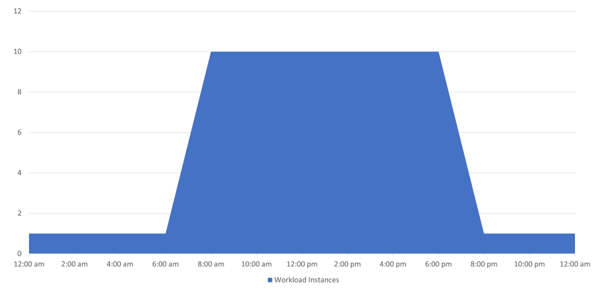

## TL;DR

Cron 擴縮器讓您根據時間排程來擴縮工作負載。定義開始和結束時間，在此時間範圍內維持指定的副本數。常用於在工作時間擴展、非工作時間縮減到 0 的場景。

---

## 翻譯 (Translation)

### 觸發器規格

此規格描述根據 cron 排程擴縮工作負載的 `cron` 觸發器。

```yaml
triggers:
- type: cron
  metadata:
    # 必填
    timezone: Asia/Taipei   # 可接受的值來自 IANA 時區資料庫。
    start: 0 6 * * *        # 早上 6:00
    end: 0 20 * * *         # 晚上 8:00
    desiredReplicas: "10"
```

**參數列表：**

- `timezone` - IANA 時區資料庫中的可接受值之一。時區列表可在[這裡](https://en.wikipedia.org/wiki/List_of_tz_database_time_zones)找到。
- `start` - 表示 cron 排程開始的 cron 表達式。
- `end` - 表示 cron 排程結束的 cron 表達式。
- `desiredReplicas` - 在 cron 排程**開始和結束之間**，資源必須擴縮到的副本數。

> 💡 **注意：** `start`/`end` 支援 ["Linux 格式 cron"](https://en.wikipedia.org/wiki/Cron)（分鐘 小時 日 月 星期）。

> **注意：**
> **開始和結束時間不應相同。**

### 運作原理

CRON 擴縮器允許您定義一個時間範圍，在此範圍內您想要擴展/縮減您的工作負載。

當時間視窗開始時，它會根據您的設定從最小副本數擴展到期望的副本數。



CRON 擴縮器**不會**做的是根據循環排程擴縮您的工作負載。

### 在非工作時間縮減到 0

如果您想在辦公時間/工作時間之外將 Deployment 縮減到 0，您需要在 ScaledObject 中設定 `minReplicaCount: 0`，並在工作時間增加副本數。這樣 Deployment 將在該時間視窗之外被縮減到 0。預設情況下，ScaledObject 的 `cooldownPeriod` 是 5 分鐘，因此實際的縮減將在 cron 排程 `end` 參數後 5 分鐘發生。

嘗試反過來做幾乎總是錯誤的，即在 cron 觸發器中設定 `desiredReplicas: 0`。

> 💡 **注意**：由於 HPA 控制器會同時評估所有指標並取需要更多實例的那個（`max(metrics)`），`desiredReplicas` 設定的值技術上作為「動態」最小副本數。例如，如果您有其他觸發器如 CPU，在 `start` 和 `end` 之間的時間，您將至少有 `desiredReplicas` 個副本，因為有那個 `max(metrics)`。

#### TL;DR
- 將 `minReplicaCount` 設定為 0
- 建立您的 `cron` 觸發器：定義 `start`、`end` 和 `timezone`，並將 `desiredReplicas` 設定為之前 `minReplicaCount` 的值
- 如果您還想使用其他標準來擴縮您的 Deployment，只需向您的 `ScaledObject` 新增其他觸發器

---

## 說明 (Explanation)

### Cron 表達式格式

| 欄位 | 允許值 | 特殊字元 |
|------|--------|----------|
| 分鐘 | 0-59 | * , - |
| 小時 | 0-23 | * , - |
| 日 | 1-31 | * , - |
| 月 | 1-12 | * , - |
| 星期 | 0-6（0=週日）| * , - |

### 常見時區

| 時區 | 說明 |
|------|------|
| `Asia/Taipei` | 台灣標準時間 (UTC+8) |
| `Asia/Tokyo` | 日本標準時間 (UTC+9) |
| `America/New_York` | 美國東部時間 |
| `Europe/London` | 英國時間 |
| `UTC` | 協調世界時 |

### 擴縮行為

```
時間軸：
00:00 -------- 06:00 ======== 20:00 -------- 24:00
              [start]        [end]
     0 副本    |  10 副本    |     0 副本
```

---

## 實作範例 (Practical Example)

```yaml
# 範例 1：工作時間固定副本數（6AM-8PM 10 副本，其他時間 0 副本）
apiVersion: keda.sh/v1alpha1
kind: ScaledObject
metadata:
  name: cron-workday
spec:
  scaleTargetRef:
    name: my-deployment
  minReplicaCount: 0                  # 允許縮減到 0
  cooldownPeriod: 300                 # 5 分鐘冷卻期
  triggers:
    - type: cron
      metadata:
        timezone: Asia/Taipei         # 台灣時區
        start: 0 9 * * 1-5            # 週一到週五早上 9:00
        end: 0 18 * * 1-5             # 週一到週五晚上 6:00
        desiredReplicas: "10"         # 工作時間 10 個副本
```

```yaml
# 範例 2：結合 CPU 擴縮（白天 1-10 副本動態，晚上 0 副本）
apiVersion: keda.sh/v1alpha1
kind: ScaledObject
metadata:
  name: cron-with-cpu
spec:
  scaleTargetRef:
    name: my-deployment
  minReplicaCount: 0
  maxReplicaCount: 10
  cooldownPeriod: 300
  triggers:
    - type: cron
      metadata:
        timezone: Asia/Taipei
        start: 0 8 * * *              # 每天早上 8:00
        end: 0 22 * * *               # 每天晚上 10:00
        desiredReplicas: "1"          # 最少 1 個副本
    - type: cpu
      metricType: Utilization
      metadata:
        value: "70"                   # CPU 使用率 70% 時擴縮
```

```yaml
# 範例 3：週末和工作日不同設定
apiVersion: keda.sh/v1alpha1
kind: ScaledObject
metadata:
  name: cron-weekday-weekend
spec:
  scaleTargetRef:
    name: my-deployment
  minReplicaCount: 0
  triggers:
    # 工作日設定
    - type: cron
      metadata:
        timezone: Asia/Taipei
        start: 0 9 * * 1-5            # 週一到週五
        end: 0 18 * * 1-5
        desiredReplicas: "10"
    # 週末設定
    - type: cron
      metadata:
        timezone: Asia/Taipei
        start: 0 10 * * 0,6           # 週六週日
        end: 0 16 * * 0,6
        desiredReplicas: "3"
```

```bash
# 查看當前時間（驗證時區設定）
kubectl run --rm -it --image=alpine test -- date

# 查看 ScaledObject 狀態
kubectl describe scaledobject cron-workday

# 查看 HPA 狀態
kubectl get hpa -w
```

---

## 常見錯誤與提示 (Common Mistakes & Tips)

| 常見錯誤 | 正確做法 |
|----------|----------|
| 設定 `desiredReplicas: 0` 試圖在特定時間縮減 | 設定 `minReplicaCount: 0`，讓非工作時間自動縮減 |
| `start` 和 `end` 時間相同 | 確保開始和結束時間不同 |
| 忘記設定時區 | 務必設定正確的 `timezone`，否則可能使用預設 UTC |
| 不了解 cooldownPeriod 的影響 | 縮減會在 `end` 後延遲 `cooldownPeriod` 秒 |

### 提示

- Cron 擴縮器定義的是「動態最小值」而非固定值
- 結合其他觸發器（如 CPU）可實現更彈性的擴縮
- 使用 `1-5` 表示週一到週五，`0,6` 表示週六週日
- 測試時可以設定較短的時間範圍驗證行為

---

## 快速參考 (Quick Reference)

| 參數 | 說明 | 範例 |
|------|------|------|
| `timezone` | IANA 時區 | `Asia/Taipei` |
| `start` | 開始時間 (cron) | `0 9 * * 1-5` |
| `end` | 結束時間 (cron) | `0 18 * * 1-5` |
| `desiredReplicas` | 期望副本數 | `"10"` |

| Cron 範例 | 說明 |
|-----------|------|
| `0 9 * * *` | 每天 09:00 |
| `0 9 * * 1-5` | 週一到週五 09:00 |
| `30 8 * * 1,3,5` | 週一、週三、週五 08:30 |
| `0 */2 * * *` | 每 2 小時的整點 |

| 指令 | 說明 |
|------|------|
| `kubectl get scaledobject` | 列出 ScaledObject |
| `kubectl describe scaledobject <name>` | 查看詳細狀態 |
| `kubectl get hpa -w` | 即時監控 HPA |
